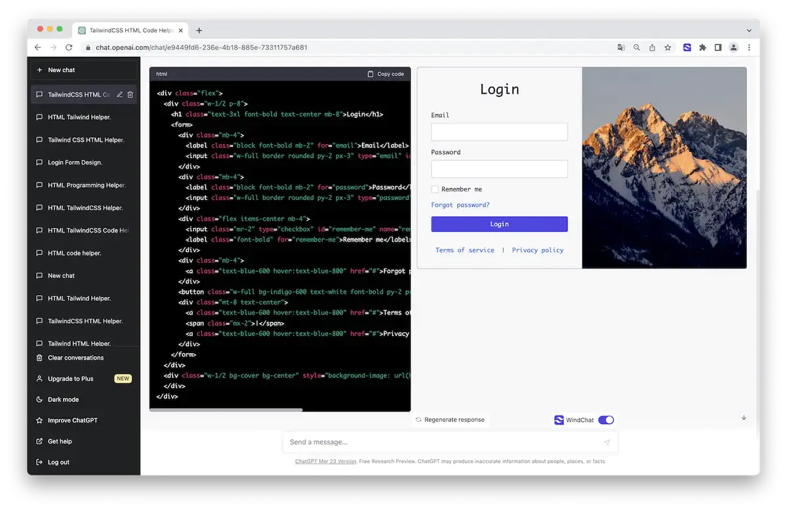
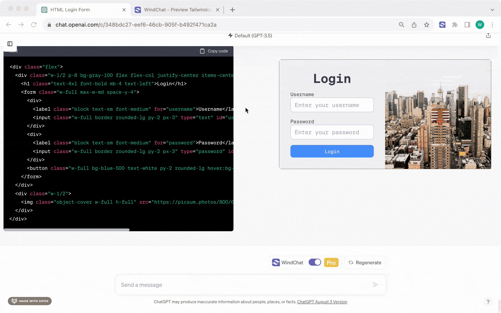
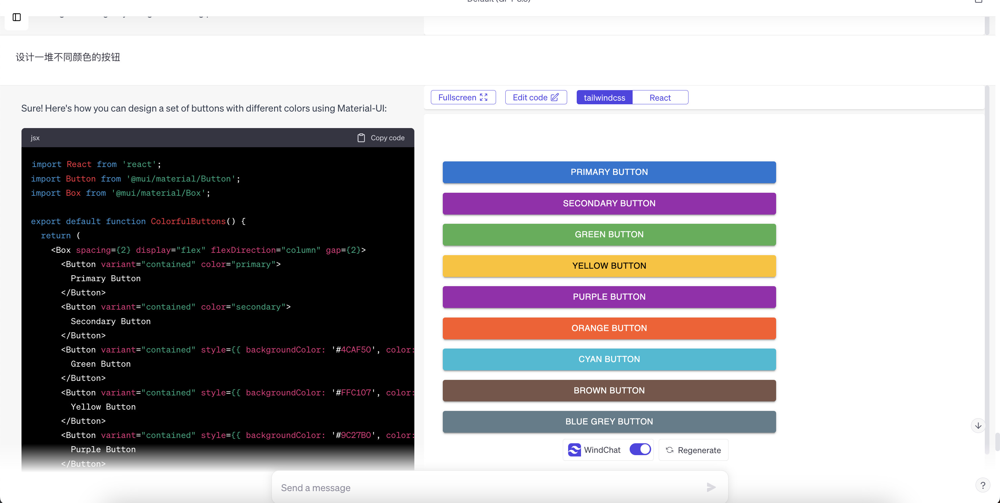
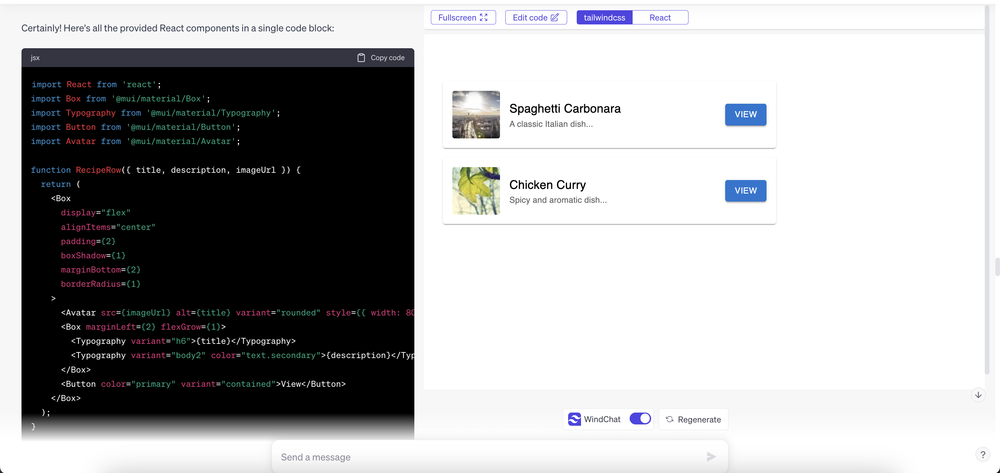
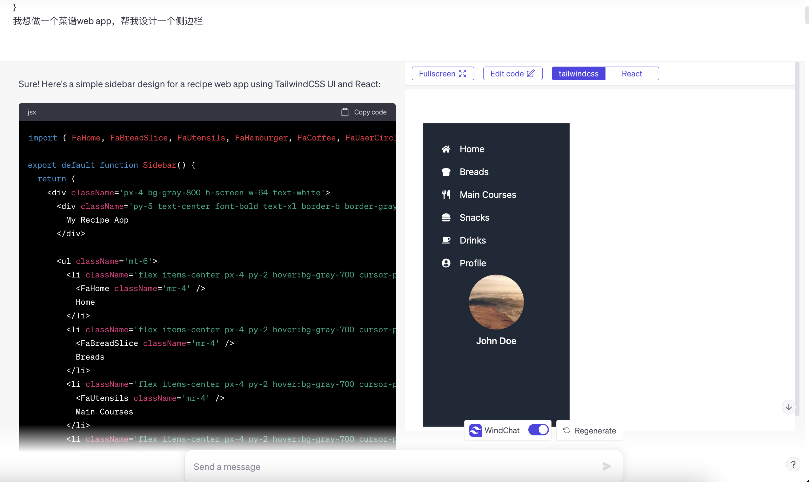

# WindChat - An open sourced "v0.dev" alternative

>注意，仓库里的代码是开发中的支持 React 的新版本，不是线上 Chrome 商店的版本。

> Please note that the code in the repository is for the upcoming version with React support in development, not the version available on the Chrome Web Store.

## Install guide

https://www.youtube.com/watch?v=9ma5KFia_0o

[Install from Chrome Webstore

](https://chrome.google.com/webstore/detail/windchat-chatgpt-tailwind/ipafbgdehdljgphjgfmpkohhbelebdhm)

## Develop guide

- `pnpm install`

- `npm run dev`

- Load `dist` folder in `chrome://extensions/` page.

## Preview Tailwincss and HTML in ChatGPT

## Preview React in ChatGPT

## Roadmap

[] Auto detect Tailwindcss or Reactjs code

[] Tailwindcss fullscreen preview and edit (redirect to https://play.tailwindcss.com/ temporarily)

[] Prompt guide
